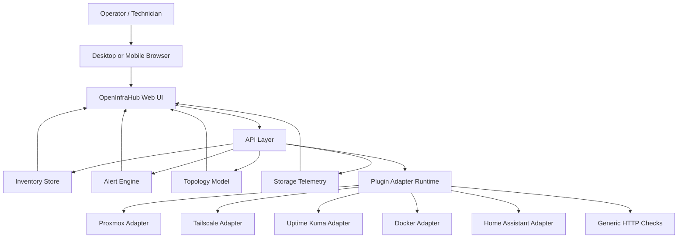
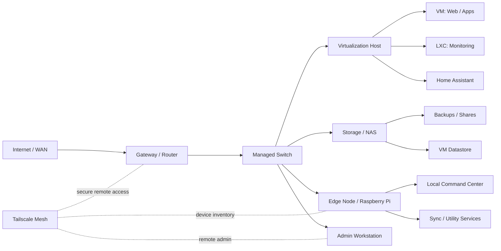
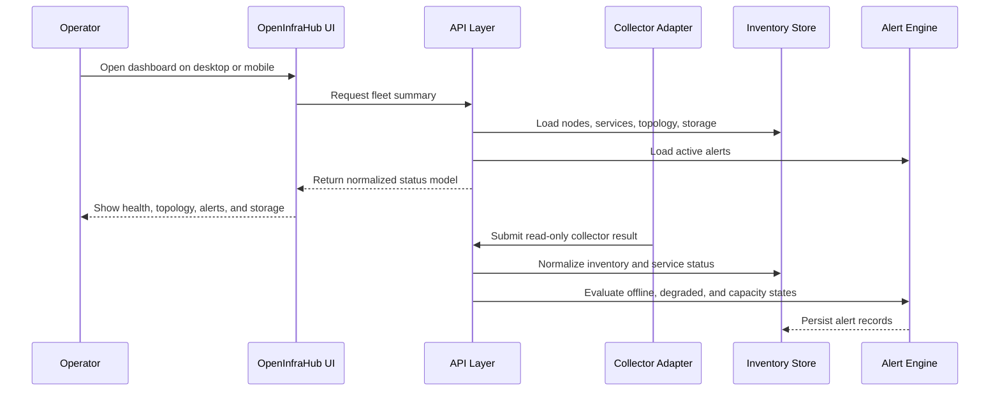

# OpenInfraHub Technical Report

Prepared for: OpenAI Codex for Open Source application support
Repository: https://github.com/dristinlee/OpenInfraHub
Public safety note: this document avoids private IP addresses, hostnames, keys, logs, screenshots, and live operational paths.

## 1. Foundation Prompt

Use this prompt when asking Codex or another AI coding assistant to improve OpenInfraHub docs, application material, or repo presentation:

```text
Build a public-safe technical report and OpenAI Codex for Open Source application summary for OpenInfraHub.

OpenInfraHub is a self-hosted infrastructure command center for homelabs, small teams, technicians, and MSP-style environments. It turns scattered infrastructure notes, service links, fleet state, topology, storage telemetry, alerts, and mobile checks into one operations surface.

Ground the report in the public repository at https://github.com/dristinlee/OpenInfraHub and the private deployment pattern represented by the local home-hub dashboard pattern. Do not expose real IP addresses, hostnames, paths, logs, screenshots, API tokens, SSH keys, or private network details. Use sanitized examples only.

Include:
- executive summary
- technical architecture
- fleet/device model
- data model
- operations workflow
- security and redaction model
- Mermaid diagrams
- why the project matters to open source users
- how Codex/OpenAI access would accelerate maintenance, docs, tests, security review, and adapter development
- next milestones for Proxmox, Tailscale, Uptime Kuma, Docker, generic HTTP checks, and mobile-first UI
```

## 2. Executive Summary

OpenInfraHub is a public-safe, open-source extraction of a real self-hosted infrastructure command center. The project is aimed at homelab operators, self-hosters, technicians, small teams, and MSP-style environments that need a simple way to understand what devices exist, what services run where, what is degraded, how storage is trending, and how the network fits together.

The current public repository already contains the right OSS foundation:

- Public GitHub repository with MIT license, contributing guide, roadmap, security policy, and launch checklist.
- Sanitized example configuration for services, topology, storage, alerts, Tailscale, Proxmox, and dashboard widgets.
- Static demo mode with sample data and generated screenshots.
- JSON Schema for the OpenInfraHub v0.1 data model.
- GitHub Actions secret scanning with Gitleaks.
- A documented security practice for keeping private runtime config outside the public repository.

The local private dashboard pattern demonstrates that the idea is not only conceptual. It is a working command-center pattern for an edge node: system status, memory, storage, temperature, network interfaces, SSH state, readiness checks, service links, notes, and local service links.

## 3. Project Positioning

OpenInfraHub solves a practical gap between bookmark dashboards and enterprise monitoring suites. Many small operators run meaningful infrastructure but do not have the time, budget, or staffing for heavy tools. They still need inventory, topology, alerts, storage awareness, and a mobile view for quick checks.

The project is strongest when positioned as:

- A self-hosted infrastructure register.
- A mobile-first operations dashboard.
- A public-safe template for converting private infrastructure knowledge into reusable OSS.
- A future adapter platform for Proxmox, Tailscale, Uptime Kuma, Docker, Home Assistant, SNMP, and generic HTTP checks.

## 4. Current Evidence

### Public Repository

OpenInfraHub is published at:

```text
https://github.com/dristinlee/OpenInfraHub
```

Current repo attributes observed:

- Public repository.
- Default branch: `main`.
- Description: self-hosted infrastructure command center for homelabs, small teams, technicians, and MSP-style environments.
- Topics include: `self-hosted`, `homelab`, `infrastructure`, `monitoring`, `proxmox`, `tailscale`, `docker`, `dashboard`, `devops`, and `sysadmin`.
- Public-safe file structure includes `demo/`, `docs/`, `schema/`, `config/examples/`, and `.github/workflows/`.

### Public Demo and Evidence

The public repo already has:

- a static demo with sample fleet data
- desktop and mobile screenshots from the sanitized demo
- a topology prototype
- a Tailscale import prototype
- a Proxmox read-only proof of concept
- schema and documentation for the data model

## 5. Architecture Overview



## 6. Fleet and Device Model

OpenInfraHub models infrastructure as a set of nodes, services, topology edges, storage targets, and alerts.



Supported device categories:

- Servers and virtualization hosts.
- VMs and LXC containers.
- Storage devices and shares.
- Network devices such as gateways and switches.
- Workstations and mobile admin devices.
- Edge nodes such as Raspberry Pi systems.
- Service endpoints and dashboards.

## 7. Data Model

The public schema describes five core object groups:

- `nodes`: servers, VMs, containers, workstations, network devices, mobile devices, and storage targets.
- `services`: monitored applications, dashboards, admin panels, and endpoints.
- `topology`: networks and relationships between nodes, services, storage, and routes.
- `storage`: SMB, NFS, block, object, backup, and datastore targets.
- `alerts`: health, dependency, capacity, and topology findings.

```mermaid
erDiagram
    NODE ||--o{ SERVICE : hosts
    NODE ||--o{ INTERFACE : exposes
    NODE ||--o{ STORAGE : owns
    NODE ||--o{ ALERT : reports
    SERVICE ||--o{ ALERT : triggers
    STORAGE ||--o{ ALERT : triggers
    NODE ||--o{ TOPOLOGY_EDGE : from
    NODE ||--o{ TOPOLOGY_EDGE : to

    NODE {
      string id
      string name
      string kind
      string status
    }

    SERVICE {
      string id
      string name
      string kind
      string status
      string nodeId
    }

    STORAGE {
      string id
      string name
      string kind
      string status
      number capacityGb
      number usedGb
    }

    ALERT {
      string id
      string severity
      string status
      string sourceType
      string sourceId
    }

    TOPOLOGY_EDGE {
      string from
      string to
      string relation
    }
```

## 8. Operations Workflow



## 9. Security and Redaction Model

OpenInfraHub is infrastructure software, so accidental disclosure risk is high. The public project already treats that as a core design constraint.

Current security posture:

- Public repo contains code, docs, schemas, demo data, and sanitized examples only.
- Private runtime configuration stays outside Git.
- Screenshots use generated sample data.
- `.env`, secrets, tokens, SSH keys, private hostnames, IP addresses, service URLs, logs, and customer/company data are excluded.
- GitHub Actions runs Gitleaks on push and pull request.
- Security docs include release scan commands and a public/private data separation policy.

Recommended next hardening steps:

- Add schema validation in CI for all `config/examples/` files.
- Add demo smoke tests.
- Add adapter unit tests with fixture-based sample responses.
- Add a public redaction checklist to every release.
- Add a `SECURITY_REVIEW.md` or release template requiring secret scan confirmation.

## 10. Why This Matters For OSS Qualification

This repository is strong enough to support an OpenAI / Codex-for-OSS style review because it now shows:

- a real product idea rather than a throwaway demo
- a public-safe extraction of a private deployment
- a clear maintainer narrative
- sample data and demo screenshots
- security-first publishing habits
- working artifacts, not just planning notes

The project is also relevant to a broad audience:

- homelab operators
- technicians
- small businesses
- self-hosters
- MSP-style environments

## 11. What Is Still Private

The following remain intentionally out of the public repo:

- exact device names tied to the owner
- exact LAN and mesh addresses
- any private company project details
- credentials and API tokens
- real screenshots from private admin panels
- private logs and backup copies

## 12. Public Repo State

OpenInfraHub now includes:

- demo UI
- screenshots from generated sample data
- JSON Schema
- redaction guide
- operations model
- Proxmox read-only PoC
- Tailscale sample importer prototype
- topology prototype
- secret scanning CI

## 13. Next Technical Steps

The next meaningful implementation steps are:

1. Turn the demo models into a real UI data store.
2. Add a typed adapter layer.
3. Wire the Proxmox read-only collector into the UI.
4. Add Tailscale import and topology rendering from normalized data.
5. Add real tests and a release build pipeline.

