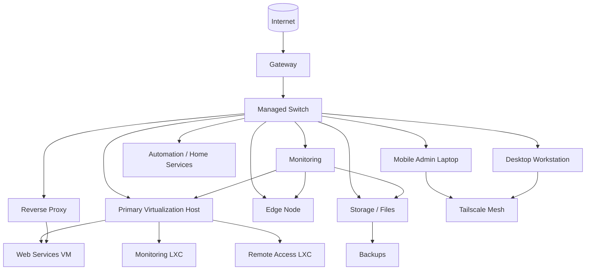
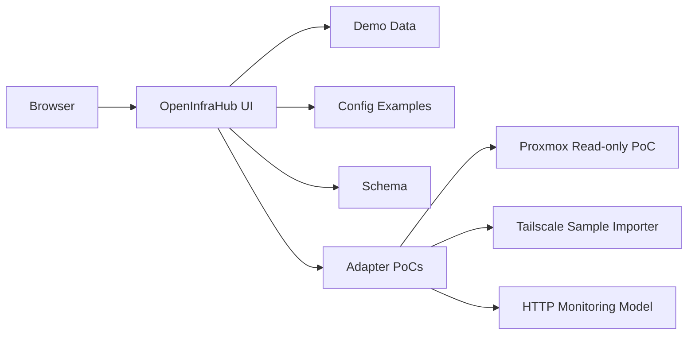

# OpenInfraHub Network Hub Report

Date: 2026-06-17

## Purpose

This report summarizes the network hub and fleet-management concept behind OpenInfraHub in a way that is safe to publish publicly.

It is based on a real private homelab / operations environment, but all sensitive details are generalized here:

- no real hostnames
- no real LAN or Tailscale addresses
- no company identifiers
- no client data
- no credentials
- no private service URLs

The goal is to show the structure of the environment, the device classes it manages, and why the project is a good public OSS candidate.

## Executive Summary

OpenInfraHub is the operations layer for a small but real infrastructure footprint:

- a primary server host running virtualization and container workloads
- a storage target serving files and backups
- a gateway and switching layer for the local network
- a mobile admin path for remote operations
- a desktop workstation and laptop used for management
- a hotspot / off-site access layer for resilience
- a service stack that includes dashboards, monitoring, reverse proxying, remote access, and file services

The project is intentionally public-safe. The published repo focuses on:

- sanitized documentation
- sample data
- a static demo UI
- a read-only Proxmox proof of concept
- topology, alert, and fleet data models

## System Overview

### Core Roles

- `Gateway`: provides WAN access and upstream routing.
- `Switch`: provides internal LAN distribution and wired device connectivity.
- `Virtualization Host`: primary compute node for VMs and containers.
- `Edge Node`: lightweight compute or utility node.
- `Storage`: files, photos, datastore, and backup capacity.
- `Admin Workstation`: main desktop operations endpoint.
- `Mobile Admin Laptop`: portable management endpoint.
- `Hotspot / Remote Access`: fallback connectivity layer.

### Service Roles

- `Proxmox`: virtualization inventory and host status.
- `Tailscale`: device visibility, mesh access, and routes.
- `Home Assistant`: automation and home service integration.
- `Caddy`: reverse proxy and TLS front door.
- `Gitea`: internal code hosting.
- `Guacamole`: browser-based remote access.
- `Uptime Kuma`: service availability monitoring.
- `SMB shares`: file and photo storage.
- `Alerts`: offline, degraded, or capacity-related states.

## Topology Diagram

## Control Plane Diagram

## Fleet Summary

| Device / Role | Purpose | Notes |
| --- | --- | --- |
| Primary server host | Virtualization and container compute | Runs the bulk of hosted services and infrastructure workloads. |
| Storage target | Files, photos, datastore, and backup capacity | Shared storage and backup destination. |
| Gateway | WAN routing and upstream access | Provides internet edge connectivity. |
| Managed switch | LAN distribution | Wires the local infrastructure together. |
| Edge node | Lightweight services | Useful for small utility workloads or side services. |
| Desktop workstation | Operations and development | Main desktop control point. |
| Mobile admin laptop | Portable control plane | Used for administration from anywhere on the LAN or via mesh access. |
| Hotspot / remote access | Connectivity fallback | Provides off-site or backup access path. |

## Service Matrix

| Service | Role | Public-safe status |
| --- | --- | --- |
| Proxmox | Host and VM inventory | Modeled by schema and read-only PoC |
| Tailscale | Mesh visibility | Modeled by sample importer and static demo |
| Home Assistant | Automation | Demo/config example only |
| Caddy | Reverse proxy | Documented in the public-safe stack |
| Gitea | Internal source hosting | Mentioned as a service class, not exposed privately |
| Guacamole | Remote access | Mentioned as a service class, not exposed privately |
| Uptime Kuma | Monitoring | Covered by data model and adapter notes |
| SMB storage | Shared files | Modeled in storage examples |

## Operational Signals

OpenInfraHub is designed to answer these questions quickly:

- What is online?
- What is offline?
- Which nodes are overloaded?
- Which services are degraded?
- Where does a service live?
- Which storage targets are growing too fast?
- What is reachable over the mesh network?
- What changed since the last check?

## Why This Matters For OSS Qualification

This repository is strong enough to support an OpenAI / Codex-for-OSS style review because it now shows:

- a real product idea rather than a throwaway demo
- a public-safe extraction of a private deployment
- a clear maintainer narrative
- sample data and demo screenshots
- security-first publishing habits
- working artifacts, not just planning notes

The project is also relevant to a broad audience:

- homelab operators
- technicians
- small businesses
- self-hosters
- MSP-style environments

## What Is Still Private

The following remain intentionally out of the public repo:

- exact device names tied to the owner
- exact LAN and mesh addresses
- any private company project details
- credentials and API tokens
- real screenshots from private admin panels
- private logs and backup copies

## Public Repo State

OpenInfraHub now includes:

- demo UI
- screenshots from generated sample data
- JSON Schema
- redaction guide
- operations model
- Proxmox read-only PoC
- Tailscale sample importer prototype
- topology prototype
- secret scanning CI

## Next Technical Steps

The next meaningful implementation steps are:

1. Turn the demo models into a real UI data store.
2. Add a typed adapter layer.
3. Wire the Proxmox read-only collector into the UI.
4. Add Tailscale import and topology rendering from normalized data.
5. Add real tests and a release build pipeline.
